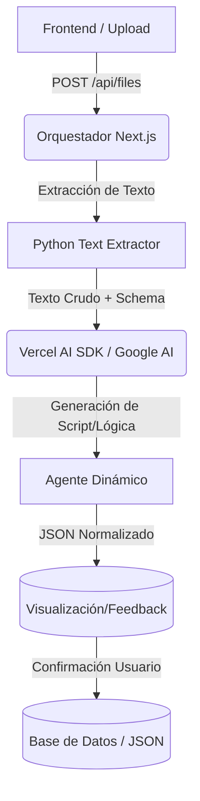

# Arquitectura de Agentes - SelfEconomy

Este documento describe la arquitectura basada en "Agentes" que utiliza el proyecto para el procesamiento y normalización de extractos financieros.

## Visión General

El sistema utiliza un enfoque híbrido donde una aplicación **Next.js 16** actúa como el orquestador principal, delegando tareas pesadas de procesamiento de datos a scripts de **Python** especializados (los "Agentes").



## 1. El Orquestador (`app/api/process/route.ts`)

Es el punto de entrada de la API. Su responsabilidad no es procesar el archivo, sino **identificar y despachar** la tarea al agente correcto.

- **Detección de Banco:** Analiza la ruta del archivo subido (ej: `bancolombia/debit/archivo.csv`) para determinar qué agente invocar.
- **Gestión de Entorno:** Ejecuta los comandos utilizando el entorno virtual de Python (`venv`) para asegurar que las dependencias estén aisladas.
- **Manejo de Archivos:** Resuelve rutas absolutas y asegura que los directorios de salida existan.
- **Interfaz:** Recibe `filePath` y `password` (opcional) y devuelve la ruta del JSON procesado o errores estandarizados.

## 2. Los Agentes (Scripts de Python)

Los agentes son scripts independientes ubicados en `app/api/py/`. Cada uno está diseñado para manejar la idiosincrasia de un formato bancario específico y convertirlo a una estructura JSON común.

### Agente Bancolombia (`bancolombia.py`)
Especializado en archivos planos y hojas de cálculo.

- **Entradas:** CSV, XLSX.
- **Capacidades:**
  - **Conversión de Formatos:** Si recibe un `.xlsx`, utiliza `pandas` para convertirlo automáticamente a `.csv` antes de procesar.
  - **Parsing Inteligente:** Lee el archivo línea por línea detectando "Secciones" dinámicamente ("Información Cliente", "Movimientos") en lugar de depender de filas fijas.
  - **Limpieza de Datos:** Maneja codificaciones (utf-8, latin-1) y formatea monedas eliminando símbolos y separadores.
- **Salida:** JSON con metadatos de la cuenta y lista de transacciones.

### Agente NuBank (`nu.py`)
Especializado en documentos PDF no estructurados.

- **Entradas:** PDF (con o sin contraseña).
- **Capacidades:**
  - **Desbloqueo de PDF:** Utiliza `pdfplumber` para abrir archivos encriptados con la contraseña del usuario.
  - **Extracción por Regex:** Utiliza potentes expresiones regulares para identificar patrones de fecha (`DD/MM`, `DD MMM`) y montos monetarios en el texto crudo.
  - **Lógica de Negocio:**
    - Detecta automáticamente si una transacción es un abono (pagos a la tarjeta) o un cargo (compras).
    - Mapea meses en texto (ENE, FEB) a números.
    - Calcula saldos implícitos cuando el extracto no los provee línea a línea.
- **Salida:** JSON con metadatos y transacciones normalizadas.

## 3. Estructura de Datos Unificada

Todos los agentes producen un JSON con la misma estructura, permitiendo que el Frontend sea agnóstico al banco de origen:

```json
{
  "meta_info": {
    "banco": "NombreBanco",
    "tipo_cuenta": "debit/credit",
    "cliente": { ... },
    "resumen": {
      "saldo_actual": 12345.00,
      "total_abonos": 100.00,
      "total_cargos": 50.00
    }
  },
  "transacciones": [
    {
      "fecha": "DD/MM",
      "descripcion": "Compra en X",
      "valor": -50000.00,
      "saldo": 100000.00
    }
  ]
}
```

## 4. Normalización Inteligente (AI-Driven)

En lugar de depender exclusivamente de scripts estáticos, el sistema evoluciona hacia una arquitectura donde la IA genera el "puente" de normalización.

- **Ingesta:** El sistema recibe archivos (PDF, CSV, XLSX) y los convierte a texto plano crudo.
- **Generación de Plantillas:** La IA analiza una muestra del texto y genera un script de Python o una configuración de mapeo que sigue el **Schema Estándar**.
- **Schema Estándar de Transacciones:**
  ```json
  {
    "fecha": "DD/MM/AAAA",
    "descripcion": "Texto limpio",
    "valor": -1234.50,
    "ignored": false
  }
  ```
- **Feedback Loop:** Antes de guardar los datos, el usuario valida en la UI (durante el upload) si la interpretación de la IA es correcta (ej: si detectó bien los signos de los montos).

## 5. Integración de Inteligencia Artificial

El proyecto utiliza inteligencia artificial para tareas avanzadas como la categorización automática de transacciones y el generador de plantillas de normalización.

- **Stack Tecnológico:**
  - **Vercel AI SDK:** Utilizado como la capa de abstracción para interactuar con modelos de lenguaje de manera sencilla y eficiente.
  - **Google AI SDK (`@ai-sdk/google`):** El proveedor principal de modelos (como Gemini) para el procesamiento de lenguaje natural.
- **System Prompt de Generación:** El sistema utiliza un prompt especializado que instruye a la IA a actuar como un Ingeniero de Datos para crear agentes de parsing basados en regex y lógica condicional.

## 6. Frontend e Interfaz de Usuario

La interfaz de usuario está construida utilizando **shadcn/ui**, lo que proporciona un conjunto de componentes accesibles y personalizables.

- **Ubicación:** Los componentes de la UI se encuentran en el directorio `components/`.
- **Uso:** Se debe priorizar el uso de estos componentes predefinidos para mantener la consistencia visual en toda la aplicación.
- **Skills Next.js 16:** Consulta [SKILLS.md](skills/nextjs/SKILLS.md) para ver las nuevas características y buenas prácticas de Next.js 16.
- **Skills Tailwind & Shadcn:** Consulta [SKILL.md](skills/tailwind/SKILL.md) para ver las convenciones de diseño, uso de Shadcn e IDs para depuración.

## 6. Arquitectura del Proyecto (Screaming Architecture)

El proyecto sigue el principio de **Screaming Architecture**, con el objetivo de que la estructura de carpetas comunique claramente la intención y las funcionalidades del sistema.

- **Organización por Funcionalidad:** Cada página principal de la aplicación debe tener su propia carpeta que contenga:
  - `page.tsx`: El componente de página principal.
  - `components/`: Carpeta con componentes específicos para esa página/funcionalidad.
  - `types/`: Definiciones de tipos TypeScript locales y específicos.
- **Legibilidad:** Esta estructura busca mantener el proyecto organizado, modular y fácil de navegar, asegurando que los componentes relacionados estén agrupados lógicamente.

## Flujo de Trabajo para Agregar Nuevos Agentes

1.  Crear nuevo script en `app/api/py/nuevo_banco.py`.
2.  Implementar la lógica que acepte `--input` y `--output`.
3.  **Dependencias:** Si el nuevo script requiere librerías adicionales, se debe registrar el paquete en el archivo `requirements.txt`.
4.  Actualizar el `route.ts` para mapear una nueva carpeta (ej: `davivienda`) al nuevo script.
