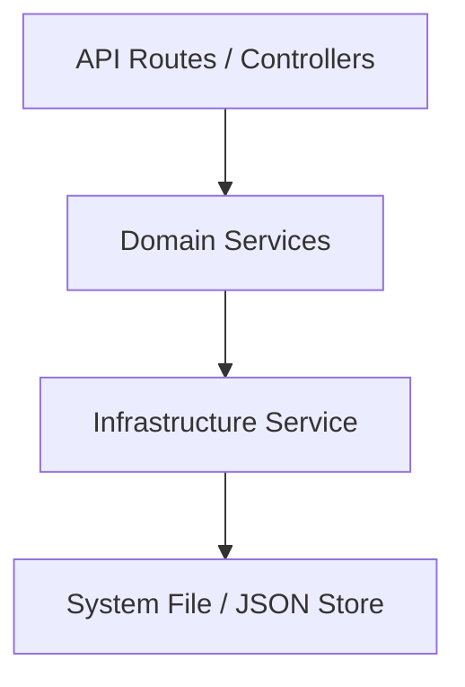

# Arquitectura de la API y Servicios

Este documento describe la estructura de servicios implementada para centralizar la lógica de persistencia y aplicar los principios SOLID en la aplicación.

## Estructura de Capas

### 1. Capa de Infraestructura (`JsonStorageService`)
Centraliza todas las operaciones de bajo nivel con el sistema de archivos para archivos JSON.
- **Responsabilidades**: Lectura, escritura, actualizaciones atómicas y creación de directorios recursivos.
- **Archivo**: [json-storage.service.ts](file:///c:/Users/fabia/Developer/SelfEconomy/SelfEconomy/lib/services/json-storage.service.ts)

### 2. Capa de Servicios de Dominio
Encapsulan la lógica de negocio y definen los esquemas de datos.

#### RuleService
Gestiona las reglas de usuario.
- **Reglas de Ignorar**: Transacciones que deben omitirse por ID o descripción global.
- **Reglas Positivas**: Transacciones de ingreso/crédito.
- **Mapeo de Categorías**: Asignación automática de categorías basadas en descripciones.
- **Archivo**: [rule.service.ts](file:///c:/Users/fabia/Developer/SelfEconomy/SelfEconomy/lib/services/rule.service.ts)

#### CategoryService
Gestiona el catálogo de categorías.
- **Consolidación**: Combina categorías por defecto (estáticas) con categorías personalizadas del usuario.
- **CRUD**: Permite añadir, editar y eliminar categorías personalizadas.
- **Archivo**: [category.service.ts](file:///c:/Users/fabia/Developer/SelfEconomy/SelfEconomy/lib/services/category.service.ts)

### 3. Capa de Rutas de API
Actúan como controladores delgados (Thin Controllers).
- **Responsabilidades**: Validación de parámetros HTTP y respuesta formateada.
- **Localización**: `app/api/`

## Principios Aplicados

### SOLID
1.  **Single Responsibility**: Cada servicio tiene un propósito único (persistencia base, reglas, o categorías).
2.  **Open/Closed**: La lógica de almacenamiento se puede cambiar (ej. a una base de datos real) modificando solo la capa de infraestructura sin tocar las rutas de la API.
3.  **Dependency Inversion**: Las rutas dependen de abstracciones de servicios, no del sistema de archivos directamente.

### Clean Code
- **DRY (Don't Repeat Yourself)**: Se eliminó la duplicación masiva de código de `fs` y manejo de directorios en 4 rutas diferentes.
- **Type Safety**: Se introdujeron interfaces para todas las reglas y categorías.
