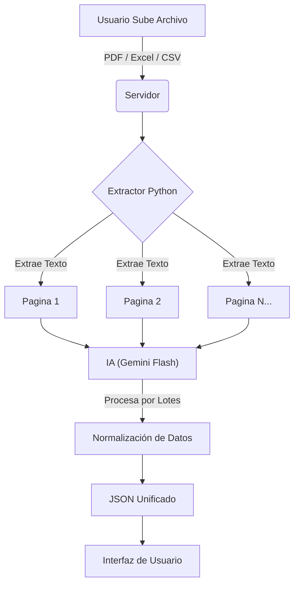

# SelfEconomy 💰

## Mi Problema Personal
Quiero tener más control de mis finanzas. Para ello es importante saber en qué estamos gastando nuestro dinero. Los excels o PDFs de extractos bancarios contienen toda la información, pero hacer un análisis a simple vista con esos documentos no es sencillo y es poco intuitivo. Con esta app quiero resolver esto.

## La Solución
Mi idea es poder convertir archivos **XLSX, CSV o PDF** para normalizar los datos y juntarlo todo en una misma aplicación. 

A diferencia de otras apps en el mercado, donde tienes que ingresar manualmente cada gasto (lo que consume tiempo o lleva a que se te olvide), **SelfEconomy** busca automatizar este proceso.

## Mi Objetivo
Ahorrar tiempo y crear una aplicación que reciba y entienda cualquier archivo para normalizar los datos de manera centralizada. De esta forma, podemos ver qué estamos haciendo con nuestro dinero de una manera mucho más rápida y eficiente.

## Características Principales
- **Normalización de Datos**: Centraliza información de diferentes bancos y formatos.
- **Integración con IA**: Categorización automática de transacciones mediante inteligencia artificial para agilizar el proceso.
- **Visualización Intuitiva**: Análisis rápido de tus finanzas personales.

## ¿Cómo Funciona? 🤖

El corazón de SelfEconomy es su capacidad para transformar documentos no estructurados en datos útiles mediante un proceso inteligente:



### 1. Extracción Inteligente (Chunking)
Para manejar archivos grandes sin perder información ni exceder los límites de tokens de la IA, utilizamos un script de Python (`pdfplumber` para PDF, `pandas` para Excel/CSV) que pre-procesa el documento.
- **División Estratégica**: El texto no se envía de golpe. Se extrae y se divide en "páginas" o bloques lógicos.
- **Tokens Optimizados**: Esto asegura que la IA pueda leer cada transacción con precisión, sin alucinar por sobrecarga de información.

### 2. Procesamiento con IA
Cada bloque de texto se envía a la IA (Gemini 2.5 Flash) con instrucciones precisas para:
- Detectar fechas, descripciones y montos.
- Identificar signos (gastos vs ingresos) basado en el contexto (crédito vs débito).
- Ignorar saldos irrelevantes y encabezados.

### 3. Almacenamiento "JSON as Database"
En lugar de una base de datos compleja (SQL/Postgres), elegí un enfoque **File-Based**:
- **JSON = Extracto**: Cada archivo procesado se guarda como un JSON independiente.
- **Gestión Simple**: Si quieres eliminar un extracto, simplemente eliminas el archivo (desde la UI). Es tan intuitivo como borrar el PDF original de tu carpeta.
- **Portabilidad**: Tus datos son tuyos, en un formato estándar y legible.

---

## 🚀 Roadmap / Futuras Optimizaciones

Actualmente, el proceso depende 100% de la IA para cada lectura, lo cual es efectivo pero consume tokens. Para el futuro, planeo implementar un **Sistema Híbrido de Aprendizaje**:

- **Aprendizaje de Patrones**: Usar la primera lectura de la IA para "aprender" la estructura del banco (Regex pasivo).
- **Generación de Templates**: Crear automáticamente un "driver" o plantilla para ese banco específico.
- **Extracción Determinista**: Que los siguientes extractos del mismo banco se procesen con código (Regex/Python) en lugar de LLM, reduciendo costos y tiempos a casi cero.
- **Feedback Loop**: Un chat interactivo donde el usuario pueda corregir a la IA si se equivoca, y que el sistema mejore su template automáticamente.

---

Espero que este proyecto pueda ayudar a cualquier persona interesada en mejorar sus finanzas personales. Si deseas contribuir, ¡eres bienvenido! Es una herramienta fácil de implementar que busca aportar un grano de arena al bienestar financiero de todos.

## Requisitos Previos

Antes de comenzar, asegúrate de tener instalados:

- **Node.js**: Versión 18 o superior.
- **Python**: Versión 3.10 o superior (necesario para el procesamiento de archivos).

## Desarrollo Local

Primero, ejecuta el servidor de desarrollo:

```bash
npm run dev
# o
yarn dev
# o
pnpm dev
# o
bun dev
```

Abre [http://localhost:3000](http://localhost:3000) en tu navegador para ver el resultado.

